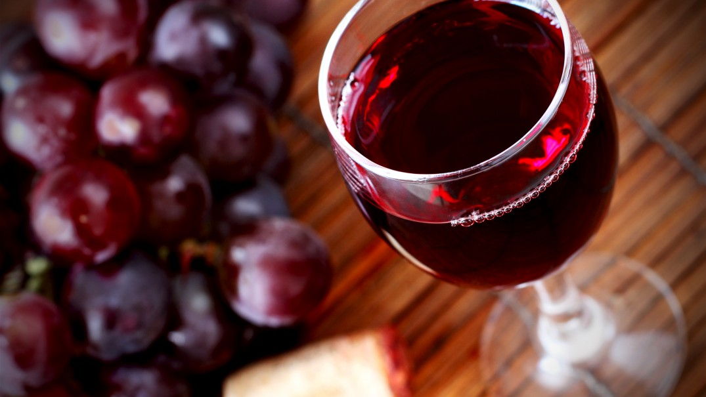

# Red-Wine-Quality-EDA-With-R

# Introduction

We are going to investigate the Red Wine dataset on `physicochemical properties` and `quality ratings`. 
We will be analyzing a dataset with `1,599 red wine sample`s from the north of Portugal. 
Each wine sample comes with a `quality rating from one to ten`, and results from several `physical chemical tests`, such as: 
alcohol content, acidity level and residual sugar. There are 11 columns describing their chemical properties, and a column for 
quality ratings. 

**Description of attributes**:

   1 - fixed acidity: most acids involved with wine or fixed or nonvolatile (do not evaporate readily)

   2 - volatile acidity: the amount of acetic acid in wine, which at too high of levels can lead to an unpleasant, vinegar taste

   3 - citric acid: found in small quantities, citric acid can add 'freshness' and flavor to wines

   4 - residual sugar: the amount of sugar remaining after fermentation stops, it's rare to find wines with less than 1 gram/liter and 
   wines with greater than 45 grams/liter are considered sweet

   5 - chlorides: the amount of salt in the wine

   6 - free sulfur dioxide: the free form of SO2 exists in equilibrium between molecular SO2 (as a dissolved gas) and bisulfite ion; it 
   prevents microbial growth and the oxidation of wine

   7 - total sulfur dioxide: amount of free and bound forms of S02; in low concentrations, SO2 is mostly undetectable in wine, but at 
   free SO2 concentrations over 50 ppm, SO2 becomes evident in the nose and taste of wine

   8 - density: the density of water is close to that of water depending on the percent alcohol and sugar content

   9 - pH: describes how acidic or basic a wine is on a scale from 0 (very acidic) to 14 (very basic); most wines are between 3-4 on the 
   pH scale

   10 - sulphates: a wine additive which can contribute to sulfur dioxide gas (S02) levels, wich acts as an antimicrobial and antioxidant

   11 - alcohol: the percent alcohol content of the wine

   Output variable (based on sensory data): 
   
   12 - quality (score between 0 and 10)

For more information [click here](https://s3.amazonaws.com/udacity-hosted-downloads/ud651/wineQualityInfo.txt).

In this project our main goal is to discover which chemical propeties influence the quality of red wines and to understand how these 
characteristics influence the quality. After that, we will create a model to predict the quality of wine.
